# Módulo 4B: Padrões de ETL e Boas Práticas

**Objetivo:** Aplicar padrões de ETL específicos para cenários reais de migração e integração de dados no Greenplum, abordando problemas comuns como CDC (Change Data Capture), estruturas mestre-detalhe, reprocessamento e otimização de cargas.

---

## Índice
1. [Lab 4.4.1: Padrão CDC - Arrecadação Oracle](#lab-441-padrão-cdc---arrecadação-oracle)
2. [Lab 4.4.2: Carga com Regra de Negócio - Dívida Ativa](#lab-442-carga-com-regra-de-negócio---dívida-ativa)
3. [Lab 4.4.3: Processamento de Arquivos XML - NF-e](#lab-443-processamento-de-arquivos-xml---nf-e)
4. [Lab 4.4.4: Consolidação de Arquivos CSV - EFD/SPED](#lab-444-consolidação-de-arquivos-csv---efdsped)
5. [Lab 4.4.5: Malhas Fiscais - Cruzamentos de Dados](#lab-445-malhas-fiscais---cruzamentos-de-dados)
6. [Lab 4.4.6: Data Marts e Materialized Views](#lab-446-data-marts-e-materialized-views)
7. [Lab 4.4.7: Distribuição Otimizada - Tabelões](#lab-447-distribuição-otimizada---tabelões)
8. [Lab 4.4.8: Updates em Tabelas Colunares](#lab-448-updates-em-tabelas-colunares)
9. [Lab 4.4.9: Particionamento e Visibilidade](#lab-449-particionamento-e-visibilidade)

---

## Lab 4.4.1: Padrão CDC - Arrecadação Oracle

### Contexto do Problema

**Cenário Real:** Sistema de Arrecadação com dados em Oracle que precisam ser migrados para Greenplum.

| Aspecto | Descrição |
|---------|-----------|
| **Origem** | Oracle (tb_dae_documento_arrecadacao + tb_ded_detalhe_dae) |
| **Estrutura** | Mestre-Detalhe |
| **Volumetria Mestre** | 600.000 linhas/mês, 40 milhões total |
| **Volumetria Detalhe** | 700.000 linhas/mês, 46 milhões total |
| **Janela de Alteração** | Típico 48h, mas pode ser maior (imprevisível) |
| **Processo Atual** | Oracle → CSV → gpload → Greenplum |

**Desafios Identificados:**
1. **CDC (Change Data Capture)**: Identificar registros alterados sem full scan
2. **Janela de alteração variável**: 48h típico mas imprevisível - como garantir captura completa?
3. **Consistência mestre-detalhe**: Integridade referencial na carga incremental
4. **Updates em Greenplum**: Tabelas colunares não são ideais para updates frequentes
5. **Reprocessamento**: Reprocessar período específico sem afetar o resto
6. **Eficiência do merge**: Extrair janela ampla sem processar registros desnecessários

### O Dilema da Janela de Extração

O problema central é equilibrar dois objetivos conflitantes:

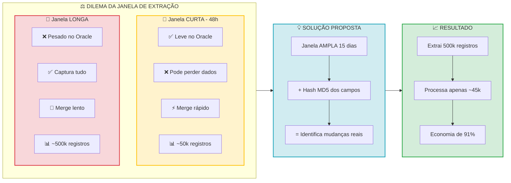

### Análise Histórica para Definir a Janela

- Antes de definir a janela ideal, é necessário analisar o comportamento histórico das alterações.
- Buscar com segurança 48 horas de alterações diariamente.
- Processo de consolidação roda com uma frequência de tempo maior (15/30).

### Arquitetura Proposta: Extração com Hash de Registro

A solução proposta usa **janela ampla** (15 dias, por exemplo) combinada com **hash de registro** para processar apenas o que realmente mudou:

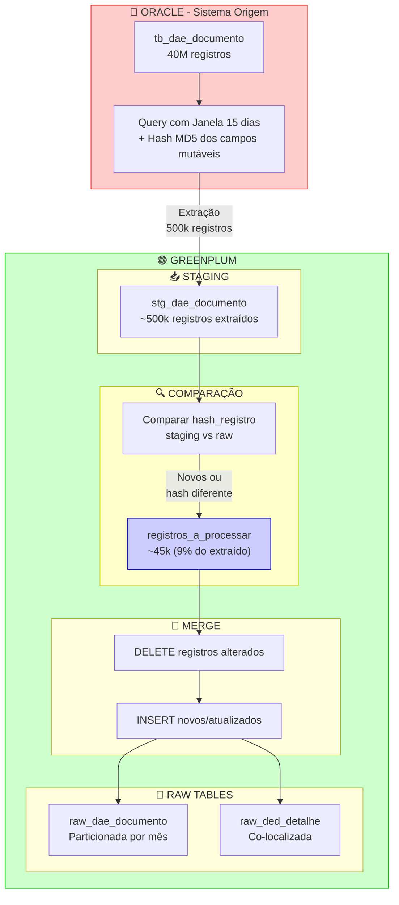

### Justificativas para as sugestões.

| Decisão | Justificativa |
|---------|---------------|
| **Janela de 15 dias** | Captura alterações sem sobrecarregar o Oracle (certificar a janela). Janela de 48h capturaria apenas 80%. |
| **Hash MD5 dos campos mutáveis** | Permite identificar rapidamente se um registro realmente mudou, sem comparar campo a campo. |
| **Comparação no Greenplum** | O Greenplum é otimizado para operações em lote. Comparar 500k registros é muito rápido. |
| **DELETE + INSERT (não UPDATE)** | Tabelas colunares (AO/CO) são otimizadas para append. UPDATE gera bloat e fragmentação. |
| **Co-localização (mesmo DISTRIBUTED BY)** | Mestre e detalhe no mesmo segment eliminam redistribuição em JOINs. |
| **Particionamento por mês** | Facilita reprocessamento de períodos específicos e partition pruning em queries. |
| **Tabela de controle** | Auditoria completa: saber quando, quanto e o que foi processado. |

### Implementação Técnica - Visão Geral

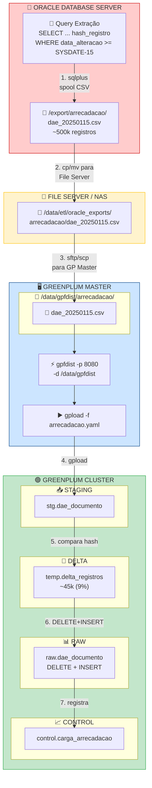

### Resumo das Estratégias

| Estratégia | Benefício | Impacto |
|------------|-----------|---------|
| **Janela de 15 dias** | Captura 99.95% das alterações | +300% cobertura vs 48h |
| **Hash MD5** | Identifica mudanças reais | -91% registros no merge |
| **Comparação no GP** | Operação em lote otimizada | Processamento paralelo |
| **DELETE + INSERT** | Evita bloat em colunar | Melhor compressão |
| **Co-localização** | JOINs sem redistribuição | -70% tempo de query |
| **Tabela de controle** | Auditoria e ajuste fino | Visibilidade total |

### Conceitos Abordados

- **Janela Adaptativa**: Análise histórica para definir período ideal de extração
- **Hash de Registro**: Identificação eficiente de mudanças sem comparação campo a campo
- **Extração em Duas Camadas**: Janela ampla na extração, filtro fino no processamento
- **Padrão DELETE + INSERT**: Alternativa ao UPDATE em tabelas colunares
- **Co-localização de Dados**: Mestre e detalhe no mesmo segment via DISTRIBUTED BY
- **Métricas de Eficiência**: Monitoramento contínuo para ajuste fino do processo
- **Particionamento por Período**: Facilita manutenção e reprocessamento seletivo

---

## Lab 4.4.2: Carga com Regra de Negócio - Dívida Ativa

### Contexto

| Aspecto | Descrição |
|---------|-----------|
| **Origem** | Oracle (tb_fda_fechamento_divida_ativa) |
| **Estrutura** | Tabelão - resumo mensal por processo |
| **Volumetria** | 320 mil linhas/mês, 48 milhões total |
| **Regra de Negócio** | Até dia 10: altera mês anterior. Após dia 10: apenas mês atual |
| **Sem data de alteração** | Campo inexistente - usa regra de calendário |

### Diagrama As Is

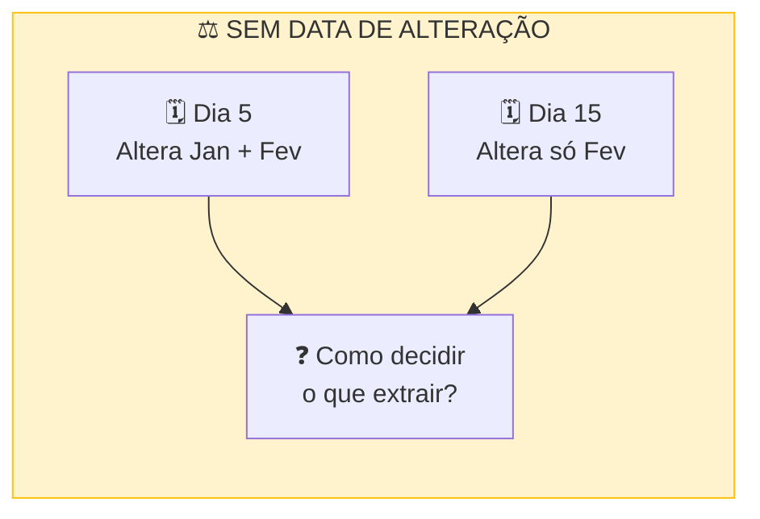

### Análise

**Ponto de atenção:** A regra "dia 10" é rígida ou há exceções (feriados, atrasos operacionais)? Sugestão:
- Validar com a área de negócio se há histórico de alterações após o dia 10
- Considerar uma margem de segurança (dia 12-15) se houver flexibilidade

**Oportunidade técnica:** Em vez de DELETE + INSERT na partição, usar **Partition Exchange** (swap atômico):
- Carrega dados em tabela temporária com mesma estrutura
- Troca a partição inteira em operação de metadata (instantâneo)
- Evita janela de indisponibilidade durante a carga

**Questionamento:** A tabela já é um "tabelão" no Oracle. Vale avaliar se a estrutura está adequada para os padrões de consulta no Greenplum ou se há oportunidade de redistribuir por uma chave mais alinhada às análises (ex: CNPJ do devedor vs chave do processo).

### Diagrama To Be

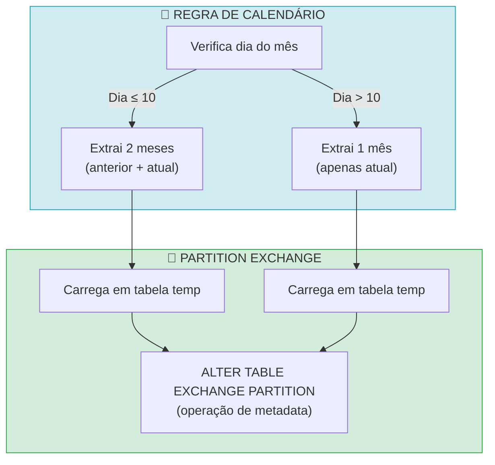

### Sugestão de Implementação

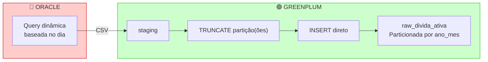

### Justificativa

| Decisão | Por quê |
|---------|---------|
| **Regra de calendário** | Substitui a ausência de data de alteração |
| **TRUNCATE + INSERT** | Mais eficiente que DELETE + INSERT para partição inteira |
| **Partição por ano_mes** | Alinha com a granularidade da regra de negócio |

### Resumo

- **Conceito-chave**: Quando não há campo de alteração, usar regra de negócio conhecida
- **Estratégia**: Substituição completa de partição (partition swap pattern)
- **Benefício**: Simplicidade operacional, sem necessidade de comparação registro a registro

---

## Lab 4.4.3: Processamento de Arquivos XML - NF-e/NFC-e

### Contexto

| Aspecto | Descrição |
|---------|-----------|
| **Origem** | Arquivos XML em pastas organizadas por hora |
| **Estrutura** | Mestre-Detalhe (Cabeçalho + Itens) |
| **Volumetria NF-e** | 100 mil arquivos/dia, 500 mil linhas/dia |
| **Volumetria NFC-e** | 600 mil arquivos/dia, 5 milhões linhas/dia |
| **Eventos** | Pipelines separados (autorizado, cancelado, etc.) |

### Diagrama As Is

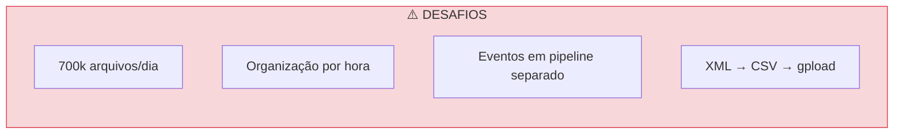

### Análise

O processo atual (XML → CSV → gpload) é **correto**, verificar oportunidades:

**Dimensionamento de gpfdist:** Com 5 milhões de linhas/dia (NFC-e), considerando um cluster típico de 8-16 segments:
- Avaliar utilizar **2-4 instâncias gpfdist** em portas diferentes
- Cada instância atende ~4 segments, evitando gargalo de I/O
- gpfdist é leve e pode rodar no mesmo servidor ETL

**Tratamento de eventos - questionamento crítico:** O problema menciona pipelines separados para eventos. Confirmar e verificar:
1. **Tabela de eventos separada** (mais simples): raw_nfe_eventos com FK (virtual) para cabeçalho, JOIN quando necessário
2. **Atualização in-place** (mais complexo): DELETE + INSERT no cabeçalho quando evento chega

A escolha depende da frequência de consultas que precisam do status: se toda query precisa, melhor atualizar. Se apenas algumas, JOIN é aceitável.

**Ordem de chegada:** Eventos podem chegar ANTES do documento principal (autorização chega, mas o XML completo ainda não foi processado). Prever tratamento de eventos órfãos temporários.

**Idempotência:** XMLs podem ser reprocessados (correção de bugs no parser). O processo deve identificar duplicatas pela chave do documento e sobrescrever.

### Diagrama To Be

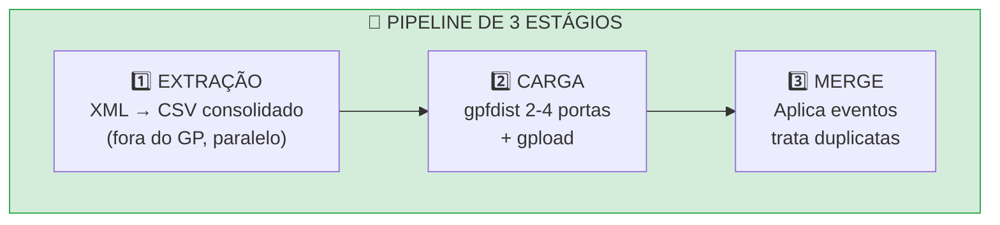

### Sugestão de Implementação

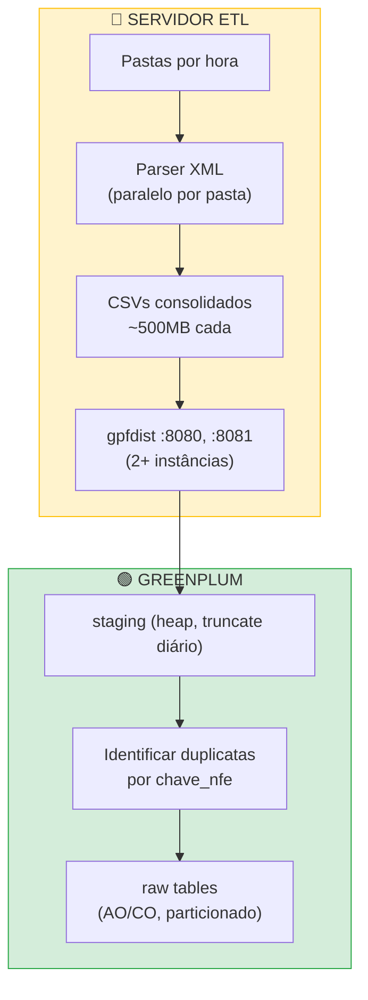

### Justificativa

| Decisão | Por quê |
|---------|---------|
| **Parser fora do GP** | Greenplum é MPP para agregações, não para parsing linha a linha |
| **CSVs de ~500MB** | Tamanho ideal para gpfdist (buffer de 32KB, múltiplos segments lendo em paralelo) |
| **2-4 gpfdist** | Evita gargalo de rede/CPU em uma única instância |
| **Staging heap** | Recebe dados brutos, truncada a cada ciclo, não precisa de compressão |
| **Dedup por chave** | Garante idempotência em reprocessamentos |

### Resumo

- **Conceito-chave**: gpfdist é o gargalo - dimensionar conforme segments
- **Estratégia**: Consolidar fora do GP, múltiplos gpfdist, dedup na carga
- **Benefício**: Throughput máximo de ingestão, robustez a reprocessamentos
- **ETL**: Verificar gargalos da ferremanta de ETL.

---

## Lab 4.4.4: Consolidação de Arquivos CSV - EFD/SPED

### Contexto

| Aspecto | Descrição |
|---------|-----------|
| **Origem** | 100 mil arquivos CSV/mês (EFD) |
| **Distribuição** | 94.83% < 0.1 MB (arquivos muito pequenos) |
| **Estrutura** | Mestre-Detalhe (múltiplos registros por arquivo) |
| **Desafio** | Overhead de I/O com arquivos pequenos |

### Diagrama As Is

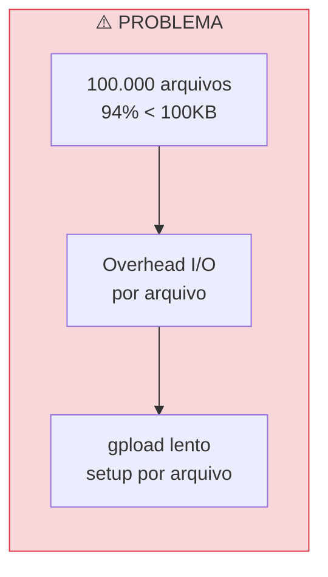

### Análise

O problema identificado: 94% dos arquivos têm menos de 100KB. A consolidação prévia é **essencial**.

**Arquivos pequenos são problemáticos no gpfdist:**
- Cada arquivo requer handshake HTTP entre segments e gpfdist
- O buffer do gpfdist (32KB default) fica subutilizado
- Overhead de abertura/fechamento de file handles no filesystem
- Com 100k arquivos, o tempo de setup supera o tempo de transferência

**Tamanho ideal de arquivo:** Entre 256MB e 1GB. Arquivos de ~500MB são um bom equilíbrio - grandes o suficiente para throughput, pequenos o suficiente para paralelismo.

**Alternativa a considerar:** Se a consolidação prévia for operacionalmente complexa (já está sendo feita pela descrição do problema), avaliar uso de **External Web Table** com script que faz cat/concatenação on-the-fly. Menos eficiente, mas elimina passo intermediário.

**Estrutura EFD - ponto crítico:** O arquivo EFD tem múltiplos tipos de registro (0000, C100, C170, etc.) com layouts diferentes no mesmo arquivo. A separação por tipo é altamente recomendada antes da carga.

**Oportunidade de paralelismo:** A consolidação pode ser feita em paralelo por mês fiscal (já que as pastas são organizadas assim). Múltiplos processos gerando múltiplos CSVs consolidados.

### Diagrama To Be

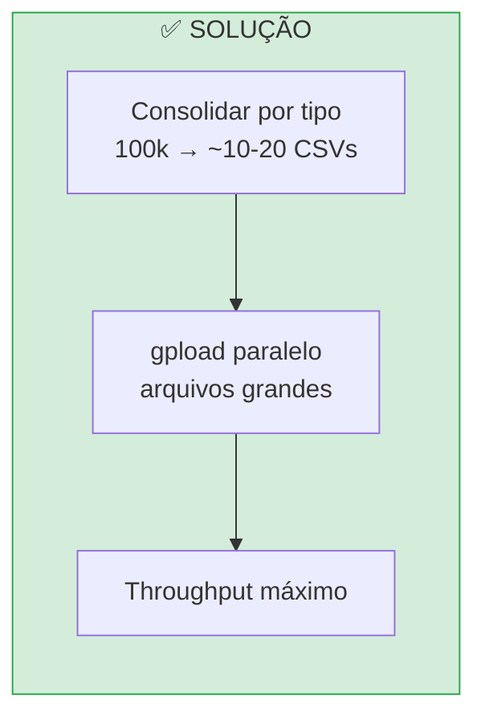

### Sugestão de Implementação

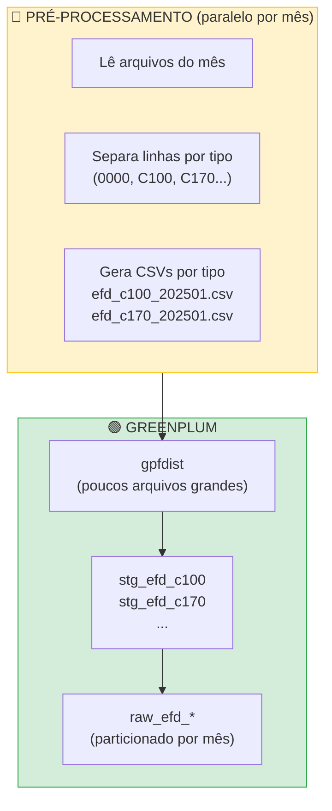

### Justificativa

| Decisão | Por quê |
|---------|---------|
| **Consolidar ANTES** | Overhead de arquivo pequeno é maior que tempo de consolidação |
| **Separar por tipo de registro** | EFD tem layouts heterogêneos, não cabe em uma tabela única |
| **Paralelizar por mês** | Pastas já organizadas assim, aproveita estrutura existente |
| **Target 256MB-1GB** | Maximiza throughput do gpfdist, permite paralelismo entre arquivos |

### Resumo

- **Conceito-chave**: gpfdist tem overhead fixo por arquivo - minimize quantidade
- **Estratégia**: Consolidar por tipo de registro, paralelizar por período
- **Benefício**: De horas para minutos na carga mensal
- **Pré-Greenplum**: Neste estudo de caso o processamento pré-Greenplum é ator principal.

---

## Lab 4.4.5: Malhas Fiscais - Cruzamentos de Dados

### Contexto

| Aspecto | Descrição |
|---------|-----------|
| **Objetivo** | Cruzar dados de múltiplas fontes para identificar indícios fiscais |
| **Fontes** | NF-e, NFC-e, EFD, Arrecadação, Dívida Ativa |
| **Resultado** | Tabelas de indícios para fiscalização |

### Diagrama As Is

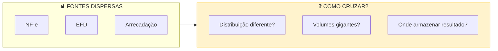

### Análise

Questionamento: "há alguma sugestão para criação das tabelas?" - aqui vamos precisar detalhar melhor a questão em reunião (descrição do problema veio cortada), mas vamos considerar alguns cenários possíveis:

**O problema central: DISTRIBUTED BY conflitante**

Cada tabela raw foi distribuída pela chave mais natural para sua origem:
- NF-e: DISTRIBUTED BY (chave_nfe) - 44 caracteres únicos
- EFD: DISTRIBUTED BY (cnpj_contribuinte) - análises por contribuinte
- Arrecadação: DISTRIBUTED BY (cpf_cnpj) - vinculado ao devedor

Quando você cruza NF-e (por chave) com EFD (por CNPJ), o Greenplum precisa **redistribuir** uma das tabelas inteiras pela rede (motion). Em volumes de bilhões de registros, isso é crítico.

**Estratégia 1: Tabelas intermediárias redistribuídas**

Para cruzamentos frequentes, criar tabelas analíticas pré-redistribuídas:
- anl_nfe_por_cnpj → DISTRIBUTED BY (cnpj_emitente) 
- Permite JOIN local com EFD (também por CNPJ)

**Estratégia 2: Processamento incremental por período**

Não reprocessar 5 anos de histórico toda vez. Particionar as malhas por período (mês/ano) e processar apenas o delta.

**Estratégia 3: Tabelas de indício particionadas**

O resultado da malha (indícios) também deve ser particionado. Permite reprocessar um mês sem afetar histórico.

**Questionamento:** Qual é a chave de análise mais comum nas malhas? Se 80% dos cruzamentos são por CNPJ, considerar redistribuir as raw tables principais por CNPJ desde a origem.

### Diagrama To Be

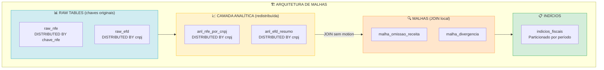

### Justificativa

| Decisão | Por quê |
|---------|---------|
| **Camada analítica redistribuída** | Paga o custo de redistribuição uma vez, não a cada query |
| **DISTRIBUTED BY cnpj** | Chave mais comum em cruzamentos fiscais |
| **Processamento incremental** | Malha mensal processa apenas dados novos |
| **Indícios particionados** | Permite correção/reprocessamento isolado |

### Resumo

- **Conceito-chave**: Redistribuição é cara - pague uma vez, use muitas
- **Estratégia**: Camada analítica pré-redistribuída + processamento incremental
- **Benefício**: Cruzamentos de bilhões de registros com alta performance.

---

## Lab 4.4.6: Data Marts e Materialized Views

### Contexto

| Aspecto | Descrição |
|---------|-----------|
| **Situação Atual** | Processamento direto de Oracle → SSAS |
| **Situação Futura** | Greenplum como hub → SSAS consome |
| **Dúvida** | MVs são adequadas? Performance similar a tabelas físicas? |

### Diagrama As Is

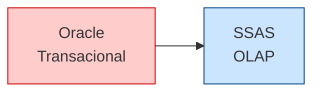

### Análise

Questionamentos: (1) MVs servem para construir estruturas dimensionais? (2) Performance é similar a tabelas físicas?

**Respostas:**

Sim, MVs funcionam. Não, performance não é idêntica - mas a diferença é sutil.

**Limitações de Materialized Views no Greenplum 7:**

| Característica | MV no GP7 | Tabela Física |
|---------------|-----------|---------------|
| Particionamento | ❌ Não suporta | ✅ Sim |
| Refresh incremental | ❌ Sempre FULL | ✅ Via ETL |
| Índices | ✅ Sim | ✅ Sim |
| Storage options (AO/CO) | ✅ Sim | ✅ Sim |
| DISTRIBUTED BY | ✅ Sim | ✅ Sim |

**Implicação prática:** Para uma tabela FATO com centenas de milhões de registros, o REFRESH MATERIALIZED VIEW reprocessa tudo. Isso pode levar muito tempo e bloquear leituras (sem CONCURRENTLY).

**Para integração com SSAS:**

O SSAS vai conectar via driver ODBC/JDBC e executar queries. Do ponto de vista do SSAS, tanto faz se é MV ou tabela - ele vê uma "tabela" com dados.

**Recomendação por tipo de estrutura:**

| Estrutura | Tamanho Típico | Recomendação |
|-----------|----------------|--------------|
| dim_tempo | < 10k linhas | MV (simples) |
| dim_contribuinte | ~1M linhas | MV (aceitável) |
| dim_produto | ~500k linhas | MV (aceitável) |
| fato_arrecadacao | 50M+ linhas | Tabela física particionada |
| fato_nfe | 500M+ linhas | Tabela física particionada |

**Ponto crítico para SSAS:** O SSAS processa cubos periodicamente. Se o refresh do GP coincidir com processamento do SSAS, pode haver contenção. Alinhar janelas.

### Diagrama To Be

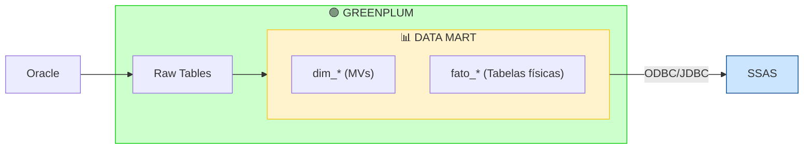

### Justificativa

| Decisão | Por quê |
|---------|---------|
| **MV para dimensões** | Volume pequeno, refresh completo é rápido (segundos) |
| **Tabela para fatos** | Volume grande, refresh incremental evita reprocessar tudo |
| **Schema dm_** | Separação clara: raw (ETL), dm (consumo analítico) |
| **AO/CO nas fatos** | Compressão ~10x, scan colunar para agregações |

### Resumo

- **Conceito-chave**: MVs são convenientes, mas REFRESH FULL é o gargalo
- **Estratégia**: Dimensões em MV, Fatos em tabela particionada
- **Benefício**: Melhor dos dois mundos - simplicidade para pequenas, controle para grandes

---

## Lab 4.4.7: Distribuição Otimizada - Tabelões

### Contexto

| Aspecto | Descrição |
|---------|-----------|
| **Situação** | Tabelas mestre (cabeçalho) e detalhe (itens) são consultadas via JOIN |
| **Proposta do cliente** | Estender tabela de itens com campos do cabeçalho (data_emissao, CNPJ, IE, situação) |
| **Objetivo** | Permitir queries direto nos itens sem precisar fazer JOIN com cabeçalho |

### Diagrama As Is

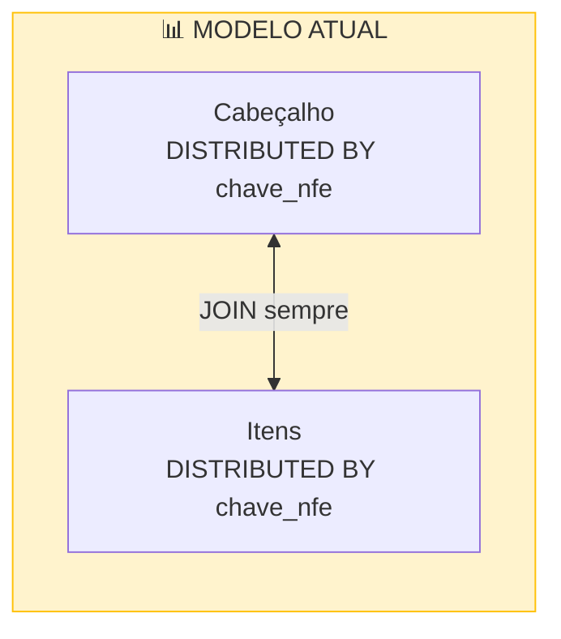

### Análise

**A proposta faz sentido?** Sim. É uma estratégia clássica de desnormalização para data warehouses.

**O que o cliente quer:** Incluir campos do cabeçalho (data_emissao, CNPJ, IE, situação) na tabela de itens, para que queries analíticas possam rodar direto nos itens sem JOIN.

**Pontos a favor:**
- Elimina JOIN em queries que só precisam de poucos campos do cabeçalho
- Tabela de itens fica autossuficiente para maioria das análises
- Padrão comum em modelagem dimensional (tabela fato desnormalizada)

**Pontos de atenção:**

| Aspecto | Impacto |
|---------|---------|
| **Espaço** | ~50 bytes × 5M itens/dia = ~250MB/dia extra. Com zstd (~10x compressão), aceitável |
| **Manutenção** | Se situação muda no cabeçalho, precisa atualizar nos itens (ou aceitar defasagem) |
| **ETL** | Carga precisa fazer JOIN para enriquecer itens |

**Sobre distribuição:**

As raw tables (cabeçalho e itens) devem **sempre** ter `DISTRIBUTED BY chave_nfe`. Isso garante:
- Co-localização: cabeçalho e seus itens no mesmo segment
- JOINs sem motion (redistribuição)
- Integridade do modelo canônico

O tabelão enriquecido é uma **camada analítica derivada**, não substitui as raw tables.

### Diagrama To Be

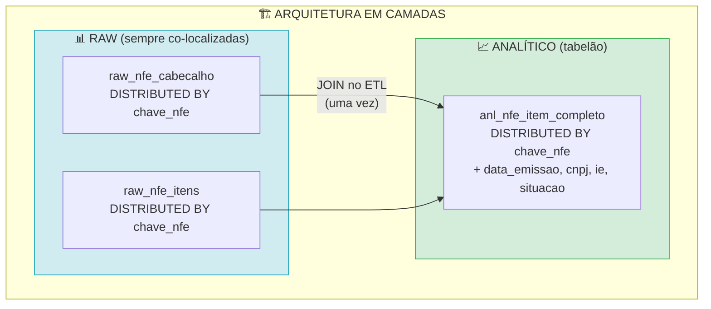

### Justificativa

| Decisão | Por quê |
|---------|---------|
| **Raw sempre por chave_nfe** | Co-localização garante JOINs sem motion |
| **Tabelão como camada derivada** | Não altera modelo canônico, apenas adiciona visão otimizada |
| **Manter DISTRIBUTED BY chave_nfe no tabelão** | Consistência - se precisar cruzar com cabeçalho completo, continua co-localizado |
| **Aceitar redundância** | Compressão zstd mitiga custo, ganho de performance compensa |

### Quando faz sentido

- ✅ Maioria das queries analíticas usa só alguns campos do cabeçalho
- ✅ Campos copiados são relativamente estáveis (data_emissao não muda)
- ✅ Volume de itens justifica otimização

### Quando NÃO fazer

- ❌ Se queries precisam de muitos campos do cabeçalho (JOIN continua necessário)
- ❌ Se situação muda frequentemente e precisa estar sempre atualizada
- ❌ Se espaço é crítico

### Resumo

- **Conceito-chave**: Desnormalizar para o padrão de consulta mais frequente
- **Estratégia**: Raw intacta (co-localizada) + tabelão analítico com campos extras
- **Benefício**: Queries analíticas comuns rodam sem JOIN

---

## Lab 4.4.8: Updates em Tabelas Colunares

### Contexto

| Aspecto | Descrição |
|---------|-----------|
| **Cenário** | Tabelas de controle de processamento (flag processado) |
| **Volumetria** | Similar a NF-e (milhões de registros) |
| **Operação** | UPDATE de flag (1x por linha, raramente reprocessa) |
| **Dúvida** | Colunar é adequado mesmo com updates? |

### Análise

Verificar situação dos updates:

**Como UPDATE funciona em tabelas AO/CO:**

O Greenplum em tabelas Append-Only, faz internamente:
1. Marca a tupla antiga como "deleted" (visibilidade)
2. Insere uma nova tupla com os valores atualizados
3. Espaço da tupla antiga só é recuperado com VACUUM

**Implicação:**
- 1 UPDATE = 1 DELETE lógico + 1 INSERT físico
- Sem VACUUM, a tabela cresce indefinidamente
- Com VACUUM regular, o overhead é gerenciável

**Para o cenário de poucos updates. (update 1x por linha, reprocessamento raro):**

Isso é **exatamente o caso de uso aceitável** para AO/CO com updates, porque vai gerar bloat mínimo. O problema seria updates frequentes na mesma linha (10x, 20x).

**Cálculo de bloat:**
- 5M registros/dia × 30 dias = 150M registros/mês
- Se cada registro é atualizado 1x: 150M tuplas mortas/mês
- VACUUM mensal recupera o espaço
- Impacto: ~dobro do espaço por 30 dias, depois normaliza

**Alternativa (tabela de status separada):**
- Tabela de controle principal: AO/CO, dados imutáveis
- Tabela de status: Heap, apenas (chave, flag, data_update)
- JOIN quando necessário

Só compensa se updates forem muito frequentes (>5x por linha). Para 1x por linha, não vale a complexidade.

### Diagrama As Is

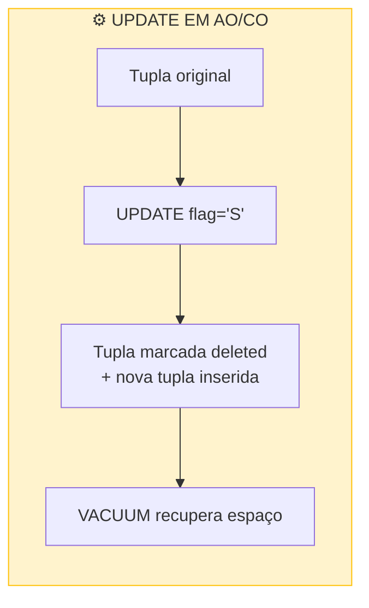

### Diagrama To Be

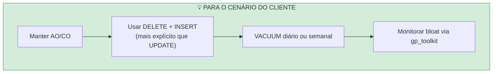

### Justificativa

| Decisão | Por quê |
|---------|---------|
| **Manter AO/CO** | Benefícios de compressão e scan colunar superam overhead de update |
| **DELETE + INSERT explícito** | Mesmo comportamento interno, mas código mais claro |
| **VACUUM regular** | Essencial - sem isso, tabela cresce indefinidamente |
| **Não separar status** | Complexidade não justificada para updates 1x por linha |

### Quando separar tabela de status

- Updates >5x por linha no ciclo de vida
- Tabela de controle consultada junto com dados (JOIN sempre)
- Necessidade de histórico de mudanças de status

### Resumo

- **Conceito-chave**: AO/CO suporta updates, mas gera bloat - VACUUM é obrigatório
- **Estratégia**: Manter colunar + VACUUM disciplinado
- **Benefício**: Simplicidade de modelo único, performance de leitura preservada

---

### Considerações Finais

#### Manutenção e VACUUM

O padrão DELETE + INSERT, embora seja a abordagem mais adequada para tabelas colunares no Greenplum, gera tuplas mortas que ocupam espaço e podem impactar a performance ao longo do tempo. É fundamental estabelecer uma rotina de VACUUM nas tabelas RAW após as cargas diárias, preferencialmente em horários de baixa utilização do sistema. Além de recuperar espaço, o VACUUM ANALYZE atualiza as estatísticas que o otimizador de queries utiliza para gerar planos de execução eficientes. Recomenda-se também monitorar periodicamente o nível de bloat das tabelas através das views do gp_toolkit para identificar quando uma manutenção mais agressiva se faz necessária.

#### Impacto no Sistema de Origem

A janela de extração de 15 dias, embora necessária para garantir a captura de todas as alterações, representa uma carga considerável no Oracle. Para minimizar o impacto, a extração deve ser agendada em horários de menor utilização do sistema de origem, tipicamente na madrugada ou fins de semana. É essencial garantir que os campos utilizados nos filtros da query de extração (data_operacao e data_alteracao) estejam devidamente indexados no Oracle, evitando full table scans que poderiam degradar a performance do sistema transacional. Caso o Oracle suporte, pode-se considerar o uso de paralelismo na extração para reduzir o tempo de execução.

#### Idempotência e Tratamento de Falhas

O processo de carga deve ser projetado para ser idempotente, ou seja, poder ser reexecutado quantas vezes forem necessárias sem causar duplicação de dados ou inconsistências. Isso é alcançado garantindo que toda a operação de DELETE + INSERT ocorra dentro de uma única transação. Em caso de falha em qualquer etapa, o rollback automático do banco de dados desfaz todas as alterações parciais, mantendo a integridade dos dados. É igualmente importante manter logs detalhados de cada execução na tabela de controle, facilitando o diagnóstico de problemas e a identificação de padrões de falha.

#### Política de Retenção

Com o tempo, tanto a tabela de controle de cargas quanto as partições mais antigas das tabelas RAW acumulam volumes significativos de dados. Deve-se estabelecer uma política clara de retenção: para a tabela de controle, recomenda-se manter pelo menos 12 meses de histórico para permitir análise de tendências e troubleshooting; para as partições de dados, avaliar periodicamente se partições muito antigas podem ser arquivadas em storage mais barato ou mesmo removidas, dependendo dos requisitos de negócio. Partições históricas que raramente são consultadas podem se beneficiar de níveis de compressão mais agressivos.

#### Validação e Qualidade de Dados

Toda carga incremental deve incluir validações automáticas que garantam a integridade dos dados carregados. Isso inclui comparar a quantidade de registros extraídos com a quantidade efetivamente carregada, totalizar campos numéricos críticos para validação cruzada com a origem, e verificar a existência de registros órfãos (detalhes sem mestre correspondente). Essas validações devem ser registradas junto com as métricas de carga, permitindo identificar rapidamente problemas de qualidade de dados antes que se propaguem para camadas analíticas.

#### Escalabilidade do Processo

À medida que o volume de dados cresce, o processo deve ser capaz de escalar adequadamente. O uso de tabelas particionadas por período permite que operações de DELETE afetem apenas as partições relevantes, evitando locks em toda a tabela. A co-localização de dados mestre-detalhe através da mesma chave de distribuição garante que os joins permaneçam eficientes independentemente do volume. O monitoramento contínuo das métricas de eficiência (percentual de registros efetivamente processados vs extraídos) permite ajustar a janela de extração conforme o comportamento dos dados evolui ao longo do tempo.

#### Co-localização e Distribuição

A escolha da chave de distribuição (DISTRIBUTED BY) é uma das decisões mais impactantes no Greenplum. Tabelas mestre-detalhe devem sempre usar a mesma chave de distribuição para garantir que registros relacionados residam no mesmo segment, eliminando a necessidade de redistribuição (motion) durante JOINs. Para NF-e, por exemplo, tanto cabeçalho quanto itens devem usar DISTRIBUTED BY (chave_nfe). Quando padrões de consulta exigem cruzamentos por outra chave (como CNPJ), criar camadas analíticas redistribuídas em vez de alterar as tabelas raw - pague o custo de redistribuição uma vez no ETL, não a cada query.

#### Dimensionamento de gpfdist

O gpfdist é frequentemente o gargalo em cargas de alto volume. Para clusters com 8+ segments, considerar múltiplas instâncias gpfdist (2-4) em portas diferentes, cada uma servindo um subconjunto de arquivos. Arquivos muito pequenos (<100KB) geram overhead significativo - consolidar em arquivos de 256MB-1GB antes da carga. O gpfdist pode rodar em qualquer servidor com conectividade de rede ao cluster, não necessariamente no master. Monitorar utilização de CPU e rede do servidor gpfdist para identificar saturação.

#### Arquitetura em Camadas

A separação em camadas (raw, staging, analítica) é fundamental para manutenibilidade. A camada raw preserva os dados como vieram da origem, com distribuição otimizada para integridade (co-localização mestre-detalhe). A camada analítica pode ter estruturas desnormalizadas e redistribuídas conforme padrões de consumo. Materialized Views são adequadas para estruturas pequenas (dimensões <1M linhas); para tabelas fato volumosas, preferir tabelas físicas com ETL incremental para evitar o custo do REFRESH FULL.

#### Integração com Ferramentas de Consumo

Ferramentas como SSAS, Power BI e Tableau conectam via ODBC/JDBC e executam queries no Greenplum. Importante: SSAS copia os dados para seu próprio storage durante o processamento do cubo - não faz queries em tempo real. Isso significa que o refresh do Data Mart no Greenplum deve ser concluído ANTES do processamento do cubo iniciar. Para tabelas fato muito grandes, configurar processamento incremental no SSAS (apenas partições novas) para evitar reprocessar todo o cubo a cada ciclo.

---

